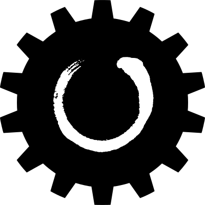

# Tetracamthon <small>0.2</small>

> A practical design practice on four(<u>tetra</u>) <u>cam</u> profiles in Py<u>thon</u>.

- Complex profiles with cam mechanism velocities synchronization.
- Free tools based on the open-sourcing FreeCAD, Python, and Blender.
- Good documentation aiming at one tutorial for young mechanical engineers.

[GitHub](https://github.com/John-Qu/tetracamthon)
[Get Started](/README.md)
